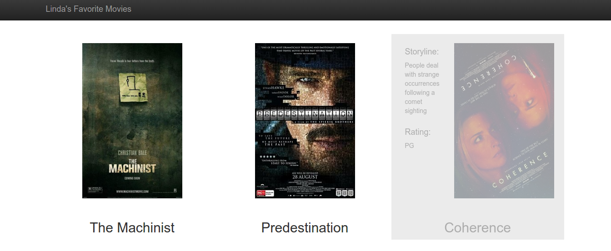

# Welcome to Linda's Movie List

### How to view the page

1. Download the following files and save them into one folder
  * media.py
  * entertainment_center.py
  * fresh_tomatoes.py
2. In the terminal, navigate to that folder and run this line:

`python entertainment_center.py`

3. You should see the page open in a new window, or a new tab if a browser window is already open


More information is displayed when hovering over an image:



### How things work

The `media.py` module contains the class `Movie`. Every instance of this class will have information about the movie's title, plot, rating, as well as a Wikipedia link to the box art and a Youtube link to its trailer.

```
class Movie():
    def __init__(self, movie_title, movie_storyline, movie_rating,
                 poster_image, trailer_youtube):
        self.title = movie_title
        self.storyline = movie_storyline
        self.rating = movie_rating
        self.poster_image_url = poster_image
        self.trailer_youtube_url = trailer_youtube
```

`entertainment_center.py` contains a list of movie objects that are instances of the `Movie` class. These instances are compiled into a list called `movies`, which is used by the `open_movies_page` function from `fresh_tomatoes.py` to create and open an HTML page. Because this module needs the class information from `media.py` and a function from `fresh_tomatoes.py`, it needs to import these two files at the top of.

`fresh_tomatoes.py` is a Python module that contains variables that store sections of HTML code in string format, as well as another function besides `open_movies_page` called `create_movie_tiles_content`, which creates the HTML code for each movie. `open_movies_page` then creates the whole HTML page by integrating the movie tiles with other essential HTML components.

The core of `fresh_tomatoes.py` is provided by Udacity; the version here contains some of my modifications which also display the movies' plot and ratings when the cursor hovers over their box art.

```
# A single movie entry html template
movie_tile_content = '''
<div class="col-md-6 col-lg-4 movie-tile text-center" data-trailer-youtube-id="{trailer_youtube_id}" data-toggle="modal" data-target="#trailer">
    
    <div class="col-lg-4 text-left storyline">
        <div><h4>Storyline: </h4></div>
        <div class="bottom-margin">{movie_plot}</div>
        <div><h4>Rating: </h4></div>
        <div>{movie_rating}</div>
    </div>
    <div><h2>{movie_title}</h2></div>
</div>
'''
```

The styling stored in the python variable `main_page_head` has been modified accordingly:
```
  .movie-tile {
        margin-bottom: 20px;
        padding-top: 20px;
        opacity: 1;
    }
  .movie-tile:hover {
      background-color: #CCC;
      cursor: pointer;
      opacity: 0.4;
  }
  .storyline {
      display: none;
  }
  .movie-tile:hover > .storyline {
      display: block;
      opacity: 1;
  }
  .bottom-margin {
      margin-bottom: 2em;
  }
```
